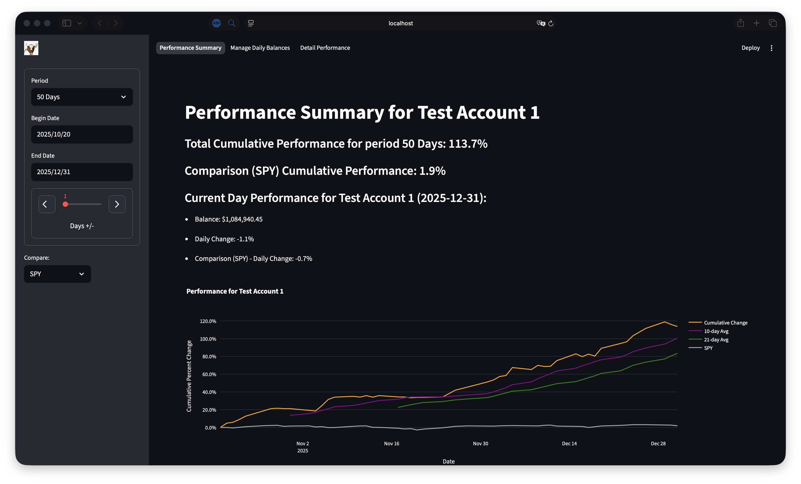
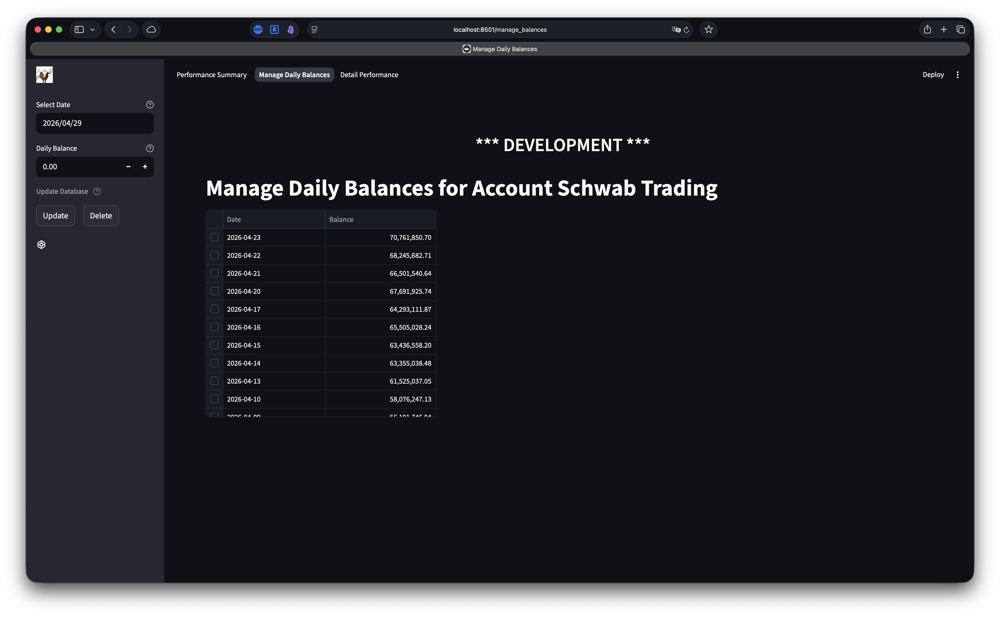
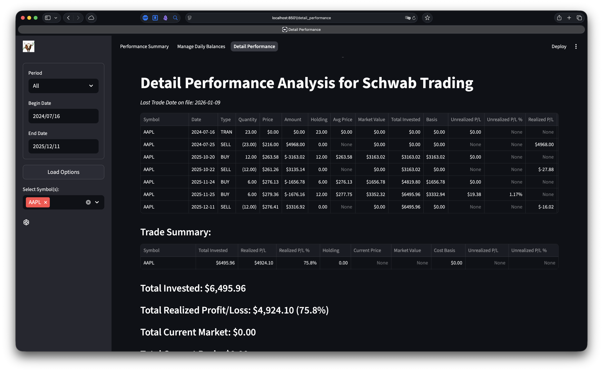

# Portfolio Dashboard

A modern web-based dashboard for tracking, analyzing, and visualizing investment portfolios using Python and Streamlit. Designed by a programmer for programmers. The idea is to provide a specialized, yet generalized platform for independent stock investors. Users with some technical chops can use the embedded tools to specialize and personalize their own system to their hearts content. Go forth and fork!

NOTE: This is very much a work in progress. I am working to improve data acquisition, but for right now it's every man/woman for themselves

---

## 📌 Features

- Portfolio tracking and performance analytics for individual investors
- Interactive visualizations with Plotly
- SQL database integration using DuckDB
- Modular architecture with clear separation of concerns
- Docker support for easy deployment

---

## Screen Shots







---

## 🛠️ Tech Stack

- **Frontend**: Streamlit
- **Backend**: Python, DuckDB
- **Data Fetching**: yfinance
- **Visualization**: Plotly
- **Dependency Management**: uv (via `pyproject.toml` and `uv.lock`)
- **Deployment**: Docker

---

## 📂 Project Structure

``` text
Portfolio_Dashboard/
├── src/
│   ├── core/                  # Core logic and utilities
│   ├── config/                # Configuration logic
│   ├── images/                # Static assets
│   ├── schemas/               # Data models and SQL scripts
│   ├── pages/                 # Individual dashboard pages
│   ├── utility/               # Helper functions
│   ├── app.py                 # Main entry point for the Streamlit app
│   └── ...
├── docker/                    # Docker configuration
├── tools/                     # Test data generation and loading
├── tests/                     # Test files
└── README.md                  # Project documentation
```

---

## 🚀 Getting Started

### Prerequisites

- Python 3.12+
- Docker (optional, for containerized deployment)
- UV (optional, for development)

### Installation (Docker)

This is the easiest installation if you just want to give it a try, or use it as is. I'm still working on the filesystem, so details of this installation will change from time to time.

1. Pull the Docker image from DockerHub:

   ```bash
   docker pull nomadmot/portfolio-dashboard:latest
   ```

2. Run docker (replace the placeholders with the path to your data directory and your watchlists directory)

   ```bash
   docker run -d \
    --volume /Path/to/your/data/directory:/var/data \
    --volume /Path/to/your/watchlists/directory:/var/watchlists \
    --name portfolio-dashboard \
    --publish 8080:8501 \
    --restart always \
    nomadmot/portfolio-dashboard:latest
   ```

### Installation (Github)

1. Clone the repository:

   ```bash
   git clone https://github.com/nomadmot/Portfolio_Dashboard.git
   cd Portfolio_Dashboard
   ```

2. **Set Up the Environment**

   - Create a virtual environment and install dependencies using:

   ```bash
   uv sync
   ```

3. **Configure the Application**

   - Copy `src/.settings/.env-example` to `src/.settings/.env`, then set:
     - `DATABASE_FILE` — the path to your DuckDB file (the app expects its tables — accounts, daily balances, securities, market holidays — to already exist in it)
     - `WATCHLIST_FOLDER` — the path to the folder holding your watchlists (reserved for the upcoming Watchlist feature)

4. **Run the App**

    ```bash
    ./run_app.sh
    ```

### Next Steps

1. ***Data Files***

   - The application's data lives in two places: a single, self-contained DuckDB file holding all portfolio data (accounts, daily balances, securities) and the market holiday calendar, and a folder of watchlists (reserved for the upcoming Watchlist feature).
   - If using Docker, mount a directory to the `/var/data` mount point for the DuckDB file and a directory to the `/var/watchlists` mount point for your watchlists.
   - When running from source, point `DATABASE_FILE` and `WATCHLIST_FOLDER` in `src/.settings/.env` at those locations.

2. ***Configuration***

   - The `.settings` folder in the application source directory contains example configuration files:
     - `.env` — environment variables: `DATABASE_FILE`, `WATCHLIST_FOLDER`, and the log levels
     - `app_config.yml` — application defaults (performance summary period and comparison symbols, time machine maximum)
   - Copy the `-example` files to `.env` and `app_config.yml` and adjust them to your setup.

***More To Come***

---

## 🚀 Roadmap

I'm continuously improving the Portfolio Dashboard based on community feedback and open issues. Below is a summary of the current priorities and planned features:

### Performance & Data Accuracy

- [#2](https://github.com/nomadmot/Portfolio_Dashboard/issues/2) Adjust the performance algorithm to account for deposits

### User Experience & Interface

- [#145](https://github.com/nomadmot/Portfolio_Dashboard/issues/145) Create an alerts page to view and filter application notifications

### New Features

- [#148](https://github.com/nomadmot/Portfolio_Dashboard/issues/148) Integrate AI chat as a first step to full AI integration
- [#164](https://github.com/nomadmot/Portfolio_Dashboard/issues/164) Add a FastAPI server for AI agent tooling
- [#101](https://github.com/nomadmot/Portfolio_Dashboard/issues/101) Create a Security Details page to provide information on selected stocks
- [#39](https://github.com/nomadmot/Portfolio_Dashboard/issues/39) Develop a Watchlist page for tracking specific stocks or assets
- [#90](https://github.com/nomadmot/Portfolio_Dashboard/issues/90) Introduce a Portfolio Journal for tracking transactions and notes
- [#43](https://github.com/nomadmot/Portfolio_Dashboard/issues/43) Enable Obsidian integration for seamless note-taking and portfolio synchronization

### Core Functionality

- [#57](https://github.com/nomadmot/Portfolio_Dashboard/issues/57) Implement support for stock splits in portfolio calculations
- [#116](https://github.com/nomadmot/Portfolio_Dashboard/issues/116) Implement a multiple account feature for easier portfolio management

### Other Planned Features

- Automated upload of user transactions and other data
- UI for reviewing custom time series on plots (Time Machine)
- Backtesting
---

## 📝 How You Can Help

If you’re interested in contributing to any of these features or fixes, check out the Contributing Guide below for detailed instructions on how to get started. I welcome contributions from everyone!

### How to Contribute

1. **Fork the Repository**

   - Click the "Fork" button on GitHub to create your own copy.

2. **Clone the Repository**

   - Clone your forked repository to your local machine and install as detailed above

     ```bash
     git clone https://github.com/your-username/Portfolio_Dashboard.git
     cd Portfolio_Dashboard
     ```

3. **Set Up the Environment**

   - Install dependencies using:

     ```bash
     uv sync --all-extras
     ```

4. **Create a Feature Branch**

   - Create and switch to a new branch:

     ```bash
     git checkout -b feature/your-feature-name
     ```

5. **Make Your Changes**

   - Implement your feature or fix. Ensure your changes align with the project’s coding standards.

6. **Write Tests**

   - Add tests in the `tests/` directory to ensure functionality.

7. **Commit Your Changes**

   - Commit your changes with a descriptive message:

     ```bash
     git add .
     git commit -m "Describe your changes here"
     ```

8. **Push Your Changes**

   - Push your changes to your forked repository:

     ```bash
     git push origin feature/your-feature-name
     ```

9. **Open a Pull Request**

   - Go to the original repository on GitHub and create a new pull request with a detailed description.

10. **Engage with Feedback**

    - Respond to any comments or suggestions from maintainers.

---

## 🤝 Code of Conduct

Please adhere to our [Code of Conduct](CODE_OF_CONDUCT.md) to ensure a welcoming and inclusive environment.

---

## 📢 Questions?

If you have any questions or need further assistance, feel free to leave a note in the discussions.
